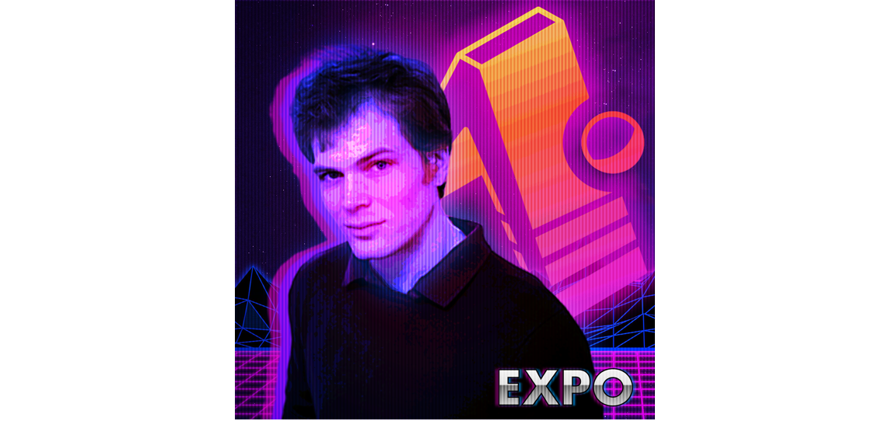

<!-- Banner -->

<!-- Platforms -->

    
    
    

    <b>Retrowave Game built for <a href="https://expo.io/">Expo</a> with <a href="https://threejs.org/">THREE.js</a>, OpenGL, WebGL, and Tween.</b>

    
    
Race through the underbelly of Cyberspace

 

    
    
The story follows a mystic neo-sage Chucky Cheevs who fights off the boring-bots known as Xamaronians

 

    

 

<h1 align="center">License</h1>

My projects are made available under the [MIT license](LICENSE). Some of the dependencies are licensed differently, with the BSD license, for example.

<!-- Footer -->

---

    
    

